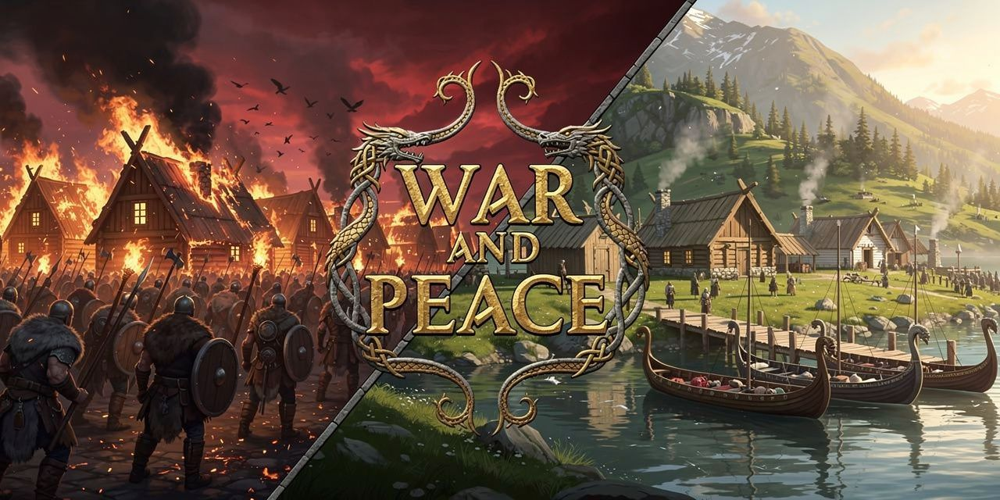

# War and Peace — живой мир фракций для Valheim

*English: [README.md](README.md)*

Мир, который живёт без тебя: по всей карте рождаются 150+ поселений викингов и
лагеря рейдеров. Они ведут экономику, торгуют караванами, строят дороги, копят
войска, маршируют армиями, осаждают и захватывают друг друга — а ты можешь
основать **своё поселение**, нанять стражу, торговать, воевать и переписывать
карту.

> ⚔ **Статус: открытая бета.** Играйте на отдельном мире, не на основном сейве.
> Баги — в GitHub Issues.

## Что внутри
- **150+ живых поселений**: экономика, склады, работники, рост по ярусам
  (аванпост → поселение → город → столица), у каждой фракции свой герб на карте.
- **Тотальная война фракций**: армии видимо идут через карту, дерутся во
  встречных боях и на море, осаждают города. Захваченный город разоряется и
  перестраивается в стиле завоевателя. Математика боёв честна к качеству
  войск — тролль стоит дороже крестьянина.
- **Твоё поселение**: построй дома, поставь **Сердце поселения** (молоток →
  Misc), назови город — и нанимай стражу-викингов (лимит = кровати, содержание —
  еда и монеты). Сломал сердце чужого города — город твой.
- **Торговля**: продавай ресурсы в пост скупки; дары в сундук — репутация.
- **Авторские здания сообщества** вшиты в мод; своё здание сохраняется прямо в
  игре (F7).

## Установка (вручную)
1. Скачай `releases/WarAndPeace-BuilderKit-<версия>.zip`.
2. Распакуй; содержимое папки `INTO-GAME-FOLDER` перенеси в корень Valheim (рядом с
   `valheim.exe`). BepInEx уже внутри.
3. Запусти игру. Всё.

## Обновление
Запусти `UPDATE-MOD-RU.bat` в папке Valheim **при закрытой игре** — он скачает
свежий билд из этого репозитория.

## В игре
- **Alt+H** — панель поселения: паспорт ближайшего города (экономика, гарнизон,
  войны, здания, отношения фракций). Твоё окно во всё происходящее.
- **F7** — студия шаблонов: сохраняй свои постройки как чертежи для всего мира.
- **F9** — полигон: вызови армию на ближайший город и смотри бой.
- Клавиши и всё остальное настраивается: [docs/config.ru.md](docs/config.ru.md).

## Мультиплеер и выделенные серверы
- Мод обязателен **на сервере И на всех клиентах**, версии должны совпадать
  (при расхождении мод предупредит в чате).
- Вся симуляция считается на сервере; конфиг сервера — главный.
- Подробно: [docs/server-setup.ru.md](docs/server-setup.ru.md). Как устроена экономика: [docs/economy.ru.md](docs/economy.ru.md).
  Справочник конфига: [docs/config.ru.md](docs/config.ru.md).

## Строителям
Хочешь, чтобы твои здания появлялись в поселениях по всему миру?
Читай [docs/building-guide.ru.md](docs/building-guide.ru.md).

## Благодарности
- **Iron Gate Studio** — за сам Valheim.
- **[RustyMods](https://thunderstore.io/c/valheim/p/RustyMods/)** — наши люди-викинги
  построены техникой рантайм-клона модели игрока, которую мы изучили в их модах
  [VikingNPC](https://thunderstore.io/c/valheim/p/RustyMods/VikingNPC/) / Norsemen
  (ассеты и код не заимствованы — но идея показала дорогу).
- **Командам BepInEx и HarmonyX** — фундамент моддинга, на котором всё стоит.
- **Нашим тестерам и строителям** — за здания сообщества, вшитые в мод, и за
  баг-репорты, которыми выкована боевая модель.

## Roadmap
Порядок, а не даты. Детали могут сдвигаться по фидбеку беты.

**Постоянно, вне версий:**
- ⚔ **Баланс фракций и NPC настраивается непрерывно** — по данным реальных боёв (каждая стычка
  оставляет пару «прогноз/факт», и модель правится цифрами, а не на глаз). Составы, сила юнитов,
  темп войны — живая настройка от билда к билду.
- 🏛 **Здания под каждую фракцию добавляются постоянно** — в мод вшивается всё больше авторских
  построек под тип и биом фракции; свои можно рисовать и присылать (см. гайд строителя).

**Вехи:**
- ✅ ~~**0.5.x — открытая бета**: калибровка модели боя, полная локализация, фиксы по репортам.~~
- ✅ ~~**0.6 — «Честная война»**: заочные бои считает **поюнитовая мини-симуляция** — дальний/ближний
  бой и кайтинг, стены и высота, потери **по типам** (маги гибнут последними, мечники — в клинче).~~
- **0.7 — «Мультиплеер»**: отлаженный кооп до 5 игроков на выделенных серверах.
- **0.8 — «Дружина»**: приказы своим городам (армии, оборона), дипломатия через репутацию и дань,
  рост и переименование города, кооп-развитие.
- **0.9 — «Живой мир+»**: именные полководцы с перками, осадная техника, засады на караваны,
  события мира, ещё больше зданий сообщества.
- **1.0 — релиз на Thunderstore**: установка в один клик, обучающие подсказки, перф, финальный баланс.
